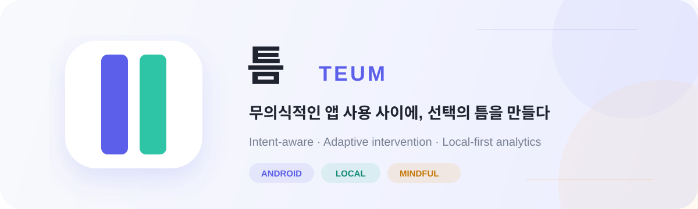
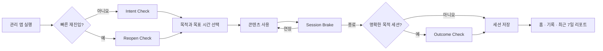
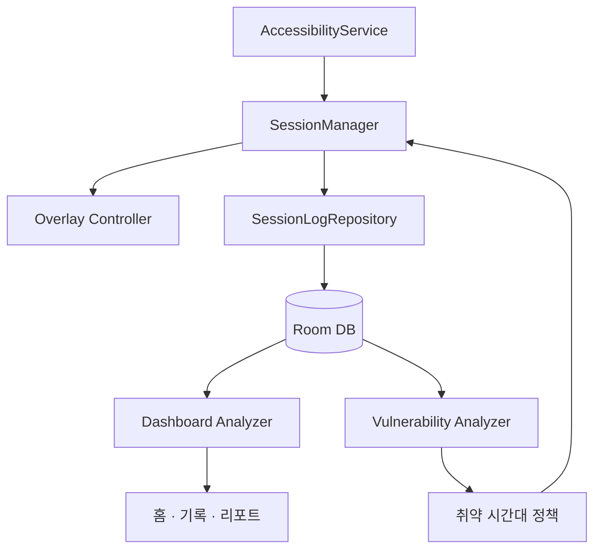

<p align="center">
  
</p>

<p align="center">
  
  
  
  
  
</p>

<p align="center">
  사용을 무조건 차단하는 대신, 앱을 여는 순간의 <strong>의도</strong>를 확인하고<br />
  사용 패턴에 맞는 개입과 로컬 리포트를 제공하는 Android 디지털 웰빙 앱입니다.
</p>

---

## 틈은 무엇이 다른가요?

SNS와 숏폼 앱을 습관적으로 열었을 때, 사용자는 종종 자신이 왜 앱을 켰는지조차 인식하지 못합니다. 틈은 앱 실행과 콘텐츠 소비 사이에 짧은 확인 과정을 넣어 사용자가 스스로 선택할 수 있도록 돕습니다.

| 핵심 기능 | 설명 |
| --- | --- |
| **Intent Check** | 앱을 연 이유를 `명확한 목적`, `인지된 휴식`, `무의식 실행`으로 구분합니다. |
| **Reopen Check** | 짧은 시간 안에 같은 앱을 다시 열면 재진입 이유를 한 번 더 확인합니다. |
| **Session Brake** | 처음 정한 목표 시간에 도달하면 종료 또는 연장을 선택하게 합니다. |
| **Outcome Check** | 명확한 목적 세션이 실제 목적 달성으로 이어졌는지 확인합니다. |
| **적응형 조심 모드** | 사용자가 조심 모드를 선택했고 현재 시간이 취약 시간대일 때 강화된 개입을 적용합니다. |
| **로컬 대시보드** | 오늘 사용, 최근 기록, 최근 7일 리포트와 취약 시간대를 기기 안에서 분석합니다. |

## 사용자 흐름



## 보통 모드와 조심 모드

틈의 강화 개입은 단순히 시간이 늦었다는 이유만으로 켜지지 않습니다.

```text
조심 모드 활성화 = 사용자가 조심 모드를 선택함 AND 현재 시간이 취약 시간대임
```

- **보통 모드**: 기본 Intent / Reopen / Session Brake 흐름을 제공합니다.
- **조심 모드**: 취약 시간대에 주황색 강조 UI와 연장 제한을 적용합니다.
- 조심 모드에서 허용되는 연장은 세션당 최대 **3회**입니다.
- 취약 시간대가 아니거나 사용자가 보통 모드를 선택한 경우에는 기본 개입으로 동작합니다.

## 취약 시간대 분석

최근 7일 동안 관리 앱에서 발생한 행동을 1시간 단위로 분석합니다. 활성 세션이 2개 이상이고 취약도 점수가 0.5 이상인 시간대를 취약 시간대 후보로 사용합니다.

```text
취약도 점수
= 초기 목표 초과율 × 0.35
+ 빠른 재진입률 × 0.35
+ 연장 점수 × 0.20
+ 실행 점수 × 0.10
```

| 지표 | 기준 |
| --- | --- |
| 초기 목표 초과율 | 처음 목표에 도달한 뒤 연장을 선택한 세션 비율 |
| 빠른 재진입률 | 5분 안에 같은 앱을 다시 연 세션 비율 |
| 연장 점수 | 시간대별 연장 횟수를 활성 세션 수로 정규화 |
| 실행 점수 | 시간대별 앱 실행 횟수를 5회 기준으로 정규화 |

첫 연장, 빠른 재진입, Outcome 응답은 세션 시작 시간이 아니라 **이벤트가 실제 발생한 시간대**에 반영합니다.

## 대시보드

### 홈

- 오늘 목표 시간 준수율
- 오늘 실제 콘텐츠 사용 시간
- 연장 횟수와 빠른 재진입 횟수
- 관리 앱별 사용 시간
- 최근 사용 세션

### 기록

- 최신 세션 카드와 전체 기록 페이지
- 관리 앱별 필터
- 최신순, 사용 시간 많은/적은 순, 연장 횟수 많은/적은 순 정렬
- 10개 단위 페이지 탐색

### 최근 7일 리포트

- 자주 흔들린 시간
- 요일별 앱 실행·연장·사용 시간
- 앱별 사용 시간
- 목적 이탈률, 연장 횟수, 빠른 재진입, 개입 후 종료
- 목표 도달 후 연장한 세션 수와 비율

## 데이터 설계

모든 분석 데이터는 Room DB에 저장되며 외부 서버 동기화 없이 기기 안에서 처리됩니다.



| 데이터 | 의미 |
| --- | --- |
| `durationMillis` | 앱 포그라운드 전체 체류 시간 |
| `interventionVisibleMillis` | Session Brake가 표시된 시간 |
| `effectiveUsageMillis` | 실제 콘텐츠 사용 시간 |
| `targetDurationMillis` | Intent Check에서 설정한 최초 목표 |
| `finalTargetDurationMillis` | 최초 목표와 연장 시간을 합한 최종 허용량 |
| `extensionCount` | 전체 연장 횟수 |
| `cautionExtensionCount` | 조심 모드 활성 상태에서 연장한 횟수 |
| `ExtensionEvent` | 각 연장의 시각·시간·당시 개입 상태 |
| `ReopenLog` | 이전 세션과 현재 세션 사이의 재진입 간격 |

사용 기록과 통계는 설정 화면에서 언제든지 전체 삭제할 수 있습니다.

## 기술 스택

- **Language**: Kotlin
- **UI**: Jetpack Compose, Material 3
- **Architecture**: Repository + ViewModel + StateFlow
- **Database**: Room, KSP, Schema Migration 1 → 11
- **Background interaction**: AccessibilityService, Overlay Window
- **Concurrency**: Kotlin Coroutines, Flow
- **Test**: JUnit4, AndroidX Test, Room Migration Test
- **Build**: Gradle Kotlin DSL, JVM 17

## 프로젝트 구조

```text
app/src/main/java/com/teum/app
├── accessibility/   # 관리 앱 감지와 전체 개입 흐름
├── core/            # 권한·모드 등 공통 모델
├── dashboard/       # 홈·기록·리포트와 분석 로직
├── data/
│   ├── local/       # Room Entity, DAO, Database
│   └── repository/  # 세션·설정·취약 시간대 데이터 접근
├── overlay/         # 오버레이 생명주기와 이벤트 연결
├── session/         # 활성 세션 상태와 연장 정책
└── ui/              # 온보딩·권한·설정·개입 Compose UI
```

## 시작하기

### 요구사항

- Android Studio
- JDK 17
- Android SDK 36
- Android 8.0 (API 26) 이상의 기기 또는 에뮬레이터

### 실행

```bash
git clone https://github.com/minimine09/teum.git
cd teum
./gradlew assembleDebug
```

Android Studio에서 프로젝트를 연 뒤 `app` 구성을 실행합니다. 첫 실행에서는 다음 권한 설정이 필요합니다.

1. 접근성 서비스
2. 다른 앱 위에 표시 권한
3. 관리할 앱 선택
4. 보통 모드 또는 조심 모드 선택

> 접근성 권한은 관리 앱의 실행을 감지하고 Intent Check를 표시하기 위해 사용합니다.

## 테스트

```bash
# JVM 단위 테스트
./gradlew testDebugUnitTest

# 연결된 Android 기기/에뮬레이터 계측 테스트
./gradlew connectedDebugAndroidTest

# 디버그 APK 빌드
./gradlew assembleDebug
```

Windows PowerShell에서는 `./gradlew` 대신 `./gradlew.bat`을 사용할 수 있습니다.

## 데모 데이터 도구

Debug 빌드에는 최근 7일의 시연용 Room 데이터를 생성하고 결과를 검증하는 도구가 포함되어 있습니다.

1. 설정 탭으로 이동합니다.
2. 상단 `설정` 제목을 5번 누릅니다.
3. 시연 데이터 생성 또는 현재 Seed 검증을 실행합니다.
4. 필요한 경우 현재 시간을 취약 시간대로 강제할 수 있습니다.

> 시연 데이터 생성은 기존 사용 기록을 삭제하고 데모 데이터로 교체합니다. Release 빌드에는 이 도구가 포함되지 않습니다.

## 협업 영역

| 영역 | 담당 범위 |
| --- | --- |
| **A · Intervention Engine** | AccessibilityService, Overlay, SessionManager |
| **B · Data & Analytics** | Room DB, Repository, 취약도 분석, Dashboard 데이터 |
| **C · UX & Presentation** | 온보딩, 권한 흐름, 화면 구성과 사용자 문구 |

---

<p align="center">
  <strong>틈</strong>은 사용을 막는 앱이 아니라,<br />
  사용자가 다시 선택할 수 있는 순간을 만드는 앱입니다.
</p>
